# Mexican Jobs 2020

In this repository I will show the complete process of gathering data using web scraping, cleaning it and analyzing it.

We will analyze the job listings posted in the official mexican job board (https://www.empleos.gob.mx) during the month of August of the year 2020.

This same project was made 2 years ago, the last year wasn't possible due to technical difficulties with the website, but this year was possible, with a few issues.


# Requirements

You will only require Python 3 and the following libraries:

* Selenium - Used to perform web scraping and web browser automation.
* Requests - Used to download individual job listings.
* lxml - Used to extract the data from the downloaded HTML files.
* pandas - Used for performing data analysis.
* plotly - Used to create plots.

# ETL Process

The ETL process for this project includes web scraping, fixing corrupted files and extracting and cleaning the data from the downloaded files.

## Web Scraping

The job listings website is made using `Java Server Faces` which is very difficult to scrape with traditional methods based on `cURL`. We will use `Selenium` to control a web browser, navigate the website and save the HTML files.

After scouting the website and understanding its navigation we know that each state in Mexico has its own section.

We will define a list of all Mexico states as shown in the main dropdown of the website (https://vun.empleo.gob.mx/contenido/publico/segob/oferta/busquedaOfertas.jsf).

```python
STATES = [
    "Aguascalientes",
    "Baja California",
    "Baja California Sur",
    ...
]
```

These names will also be used to create individual folders where we will save the HTML file of each job offer. The reason we will save the HTML files instead of performing the parsing on real time is because the website is very buggy and unstable.

The first thing to do is to define a function that will return us a `webdriver` object. This `webdriver` will be configured to strip most features that we don't need, including the GUI of the web browser itself (headless mode).

```python
def create_driver():

    chrome_options = webdriver.ChromeOptions()
    chrome_options.add_argument("--disable-extensions")
    chrome_options.add_argument("--disable-gpu")
    chrome_options.add_argument("--no-sandbox")
    chrome_options.add_argument("--log-level=3")
    chrome_options.add_argument("--headless")

    driver = webdriver.Chrome("./chromedriver.exe",
                              options=chrome_options)
    driver.maximize_window()
    driver.implicitly_wait(10)

    return driver
```

Now it's time for the main function. We start by opening the main job offers website and iterating over each state.

There's a dropdown menu with the names of each state in Mexico, we select one at time and browse the first 5 pages of results.

```python
driver = create_driver()

for state in STATES:

    print("Checking:", state)
    driver.get(INITIAL_URL)
    states_select = Select(driver.find_element_by_id("domEntFed"))
    states_select.select_by_visible_text(state)
    driver.find_element_by_xpath("//input[@value='Buscar']").click()

    # Look at the first 5 pages of results.
    for i in range(5):

        driver.find_element_by_xpath(
            "//input[@value='{}']".format(i+1)).click()
        time.sleep(3)

        # Iterate over each individual listing.
        for link in driver.find_elements_by_partial_link_text("Ver vacante"):
            listing_url = link.get_attribute("href")
            file_name = listing_url.split("=")[-1] + ".html"

            # If the job listing is not already saved we save it.
            if file_name not in os.listdir(ROOT_FOLDER + state):

                with main_session.get(listing_url, headers=HEADERS, verify=False) as response:

                    with open("{}{}/{}".format(ROOT_FOLDER, state, file_name), "w", encoding="utf-8") as temp_file:
                        temp_file.write(response.text)
                        update_log(state + "/" + file_name)
                        print("Successfully Saved:", file_name)
                        time.sleep(0.5)

driver.close()
```

We used the `Requests` module to save the contents of each listing. The job listings were not served using `Java Server Faces` so they can be accessed with a permanent link.

We implemented a few checks to avoid saving duplicate files and a log mechanism to store the date and time.

## Fixing Corrupt Files

The website had a lot of issues, sometimes I got 404 errors, sometimes it didn't even loaded.

For this reason I created a script that fixed all the files that were corrupted.

We start by iterating over each folder and check the size of each file, if the file size is too small it means we downloaded a corrupted one.

```python
for folder in os.listdir(MAIN_FOLDER):

    for file in os.listdir(MAIN_FOLDER + folder):

        full_path = MAIN_FOLDER + folder + "/" + file

        if os.stat(full_path).st_size <= 20000:
            redownload(full_path)

        check_file(full_path)

```

There's a secondary issue, sometimes we download a normal sized document but it has the contents of the 404 error page. We use the following function to check for that scenario.

```python
def check_file(full_path):

    with open(full_path, "r", encoding="utf-8") as temp_file:

        file_text = temp_file.read()

        if "Error 404" in file_text:
            print("Error", full_path)
            redownload(full_path)
```

And finally, we have the redownload function, which redownloads the HTML document and replaces the old one.

```python
def redownload(full_path):

    file_id = full_path.split("/")[-1].replace(".html", "")
    base_url = f"https://www.empleo.gob.mx/{file_id}-oferta-de-empleo-de-empleado-test-"

    with requests.get(base_url, headers=HEADERS, verify=False) as response:

        with open(full_path, "w", encoding="utf-8") as temp_file:
            temp_file.write(response.text)
            print("Redownloaded:", full_path)
            time.sleep(1)
```

I had to run this script daily and it usually fixed all the corrupt files on the first run.

## Data Extraction and Transformation

Extracting the data from the HTML documents is made using `lxml` which is a very fast parser. I found out that the HTML documents came in at least 3 different formats. We will use `XPath` to make the parsing more consistent.

We will make the use of a list of lists that will be later saved to a CSV file. We initiate this list with a header row and start iterating over all of our files.

```python
# We use multithreading to accelerate the reading of all files.
data_list = list()
data_list.append(["isodate", "offer", "salary", "contract_type", "start_hour",
                    "end_hour", "hours_worked", "monday", "tuesday", "wednesday",
                    "thursday", "friday", "saturday", "sunday", "days_worked",
                    "state", "municipality", "education_level", "experience", "languages"])

for file_name, file_date in load_files():
    parse_file(file_name, file_date)
```

We will read the contents of each HTML file using `lxml` and we will try to find the elements we need using `XPath`.

```python
def parse_file(file_name, file_date):

    # Parse the HTML document.
    html = lxml.html.fromstring(temp_file.read())

    name = html.xpath("//small[1]")[0].text.split("-")[0].lower().strip()

    salary = html.xpath(
        "//strong[contains(text(),'Salario neto mensual:')]/following-sibling::span")[0].text.strip()

    hours = html.xpath(
        "//strong[contains(text(),'Horario de trabajo:')]/following-sibling::span")[0].text.split()
```

This goes on for most of the fields. Some of them will have an additional cleaning process so they can be more easily analyzed. At the end we will have all of our fields cleaned up and saved to a new CSV file using the following function.

```python
with open("data.csv", "w", encoding="utf-8", newline="") as csv_file:
    csv.writer(csv_file).writerows(data_list)
```

# Data Analysis

Now it's time for the fun part. We have our CSV file ready and it's time to perform `Exploratory Data Analysis`.

We will be using the `pandas` and `plotly` libraries for this project. We will import them in the following way:

```python
import pandas as pd
import plotly.graph_objects as go
```

I normally use `Matplotlib` but this time I wanted to try something different.

There are 2 versions of `plotly`; plotly express and plotly graph objects. We will be using the second one as it provides us with more customization options.

We start by loading the CSV file with `pandas` and specifying the `isodate` column as a date.

```python
df = pd.read_csv("data.csv", parse_dates=["isodate"])
```

Let's take a look at our `DataFrame` using the `head()` and `tail()` methods.

```
df.head()
```

|    | isodate             | offer                            |   salary | contract_type                     |   start_hour |   end_hour |   hours_worked |   monday |   tuesday |   wednesday |   thursday |   friday |   saturday |   sunday |   days_worked | state            | municipality   | education_level   | experience      | languages       |
|---:|:--------------------|:---------------------------------|---------:|:----------------------------------|-------------:|-----------:|---------------:|---------:|----------:|------------:|-----------:|---------:|-----------:|---------:|--------------:|:-----------------|:---------------|:--------------|:----------------|:----------------|
|  0 | 2020-08-01 00:00:00 | becario recursos humanos         |     5000 | Contrato por tiempo indeterminado |          800 |       1800 |             10 |        1 |         1 |           1 |          1 |        1 |          0 |        0 |             5 | Ciudad de México | Miguel Hidalgo | Licenciatura  | 6m - 1 año      | No es requisito |
|  1 | 2020-08-01 00:00:00 | becario auditoria                |     5000 | Contrato por tiempo indeterminado |          800 |       1800 |             10 |        1 |         1 |           1 |          1 |        1 |          0 |        0 |             5 | Ciudad de México | Miguel Hidalgo | Licenciatura  | No especificada | No es requisito |
|  2 | 2020-08-01 00:00:00 | gerente operaciones              |    30000 | Contrato por tiempo indeterminado |          800 |       1800 |             10 |        1 |         1 |           1 |          1 |        1 |          0 |        0 |             5 | Ciudad de México | Cuauhtémoc     | Licenciatura  | 6m - 1 año      | No es requisito |
|  3 | 2020-08-01 00:00:00 | ingeniero mantenimiento inmueble |    24000 | Contrato por tiempo indeterminado |          800 |       1800 |             10 |        1 |         1 |           1 |          1 |        1 |          0 |        0 |             5 | Ciudad de México | Cuauhtémoc     | Licenciatura  | 6m - 1 año      | No es requisito |
|  4 | 2020-08-01 00:00:00 | coordinador instalaciones        |    25000 | Contrato por tiempo indeterminado |          800 |       1800 |             10 |        1 |         1 |           1 |          1 |        1 |          0 |        0 |             5 | Ciudad de México | Cuauhtémoc     | Licenciatura  | 6m - 1 año      | No es requisito |

```
df.tail()
```

|       | isodate             | offer                       |   salary | contract_type                     |   start_hour |   end_hour |   hours_worked |   monday |   tuesday |   wednesday |   thursday |   friday |   saturday |   sunday |   days_worked | state      | municipality           | education_level             | experience      | languages       |
|------:|:--------------------|:----------------------------|---------:|:----------------------------------|-------------:|-----------:|---------------:|---------:|----------:|------------:|-----------:|---------:|-----------:|---------:|--------------:|:-----------|:-----------------------|:------------------------|:----------------|:----------------|
| 10168 | 2020-08-31 00:00:00 | vendedor mostrador          |     4800 | Contrato por tiempo indeterminado |          800 |       1900 |             11 |        1 |         1 |           1 |          1 |        1 |          0 |        0 |             5 | Michoacán  | Morelia                | Secundaria/sec. técnica | 1 - 2 años      | No es requisito |
| 10169 | 2020-08-31 00:00:00 | vendedor empresa transporte |     6000 | Contrato por periodo de prueba    |          900 |       1900 |             10 |        1 |         1 |           1 |          1 |        1 |          0 |        0 |             5 | México     | Lerma                  | Carrera comercial       | 2 - 3 años      | No es requisito |
| 10170 | 2020-08-31 00:00:00 | mecanico automotriz         |     8000 | Contrato por tiempo indeterminado |          900 |       1800 |              9 |        1 |         1 |           1 |          1 |        1 |          1 |        0 |             6 | Nuevo León | San Pedro Garza García | Carrera técnica         | Más de 5 
años   | No es requisito |
| 10171 | 2020-08-31 00:00:00 | ayudante general            |     5500 | Contrato por tiempo indeterminado |          800 |       1800 |             10 |        1 |         1 |           1 |          1 |        1 |          0 |        0 |             5 | Nuevo León | Monterrey              | Primaria                | No especificada | No es requisito |
| 10172 | 2020-08-31 00:00:00 | auxiliar cartera            |     6000 | Contrato por periodo de prueba    |          900 |        700 |             22 |        1 |         1 |           1 |          1 |        1 |          0 |        0 |             5 | Tabasco    | Centro                 | Licenciatura            | No especificada | No es requisito |

This tells us we have 10,173 rows ranging from August 1st to August 31th.

## Job Offers by Weekday

We will check which days had the most offers posted. Since our `isodate` field is a datetime object we can use the `dt.weekday` property to quickly group it.

```python
weekdays = df["isodate"].dt.weekday.value_counts()
weekdays.sort_index(inplace=True)
    
print(weekdays)
```

|    |   counts |
|---:|----------:|
|  0 |     2,362 |
|  1 |     1,922 |
|  2 |     2,085 |
|  3 |     2,014 |
|  4 |     1,632 |
|  5 |       138 |
|  6 |        20 |

Monday (0) was the day that had more job offers posted, followed by Wednesday (2) and Thursday (4). The weekends had the least counts, as expected.

Now, let's create a line plot to see the daily distribution.

We will start by creating a pandas Series with the count of each day.

```python
days_counts = df["isodate"].value_counts()
days_counts.sort_index(inplace=True)
```

We will create a new `DataFrame` with only the data of Mondays.

```python
monday_df = days_counts[days_counts.index.weekday == 0]
```

We initialize our Figure and plot the previously created Series and Dataframe. It is important to note the small differences, such as the Monday `DataFrame` will only show markers and not lines.

```python
fig = go.Figure()

fig.add_traces(go.Scatter(x=days_counts.index, y=days_counts.values, line_color="#ffa000",
                            mode="markers+lines", line_width=3, marker_size=12))

# Highlight Mondays with a bigger marker.
fig.add_traces(go.Scatter(x=monday_df.index, y=monday_df.values,
                            line_color="#c6ff00", mode="markers", marker_size=18))

fig.update_xaxes(title="Date (2020)", ticks="outside", ticklen=10,
                    tickcolor="#FFFFFF", linewidth=2, gridwidth=0.5, showline=True, mirror=True, nticks=12)

fig.update_yaxes(title="Number of Job Offers", ticks="outside", ticklen=10,
                    tickcolor="#FFFFFF", linewidth=2, gridwidth=0.5, showline=True, mirror=True, nticks=12)
```

We add final customizations.

```python
fig.update_layout(
    showlegend=False,
    width=1200,
    height=800,
    font_color="#FFFFFF",
    font_size=18,
    title_text="Job Offers by Day",
    title_x=0.5,
    title_y=0.93,
    margin_l=120,
    margin_b=120,
    title_font_size=30,
    paper_bgcolor="#37474f",
    plot_bgcolor="#263238"
)

fig.show()
```

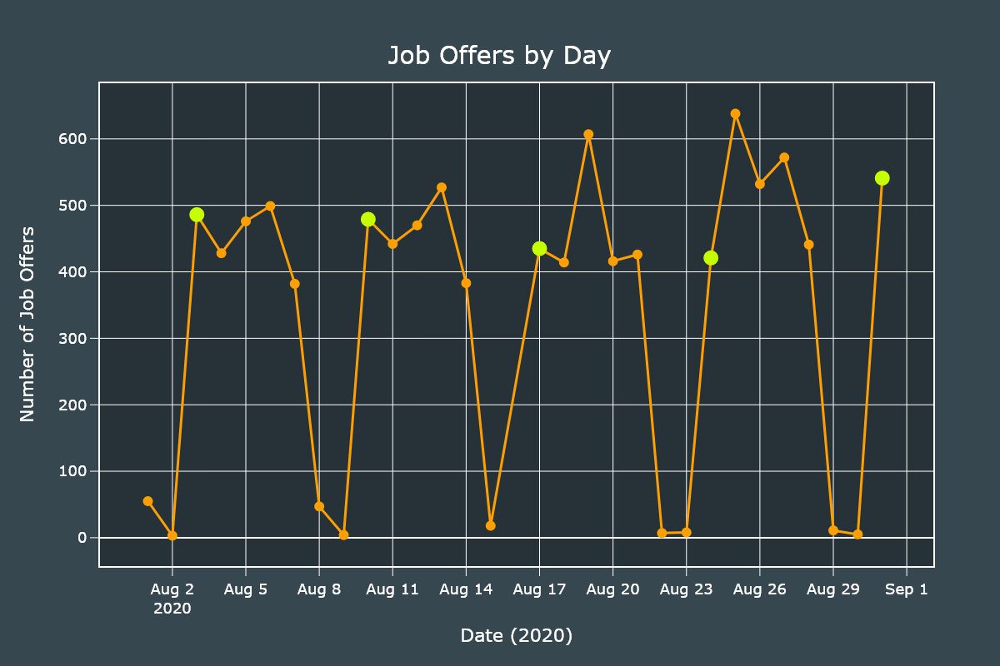

## Job Offers by State

We will obtain the distribution of job offers by state. We will create an Horizontal Bar chart and a Choropleth map.

For both charts we will use the same series which can be generated with one line of code.

```python
states_series = df["state"].value_counts()
```

We will create a Bar chart with an horizontal ortentatoin. Most of the customizations are added so the graph looks as fancy as possible but are not required.

```python
fig = go.Figure()

fig.add_traces(go.Bar(x=states_series.values, y=states_series.index, text=states_series.values,
                        orientation="h", marker={"color": states_series.values, "colorscale": "tropic"}))

fig.update_xaxes(title="Number of Job Offers", ticks="outside", ticklen=10, tickcolor="#FFFFFF",
                    linewidth=2, showline=True, mirror=True, nticks=12, title_standoff=30, gridwidth=0.5, range=[0, states_series.values.max() * 1.1])

fig.update_yaxes(title="", ticks="outside", ticklen=10, showgrid=False,
                    tickcolor="#FFFFFF", linewidth=2, showline=True, mirror=True)

fig.update_traces(texttemplate=" %{text:,.0f}", textposition="outside")
```

We ddd final customizations.

```python
fig.update_layout(
    uniformtext_minsize=8,
    uniformtext_mode="hide",
    showlegend=False,
    width=1200,
    height=1400,
    font_color="#FFFFFF",
    font_size=18,
    title_text="Job Offers by State",
    title_x=0.5,
    title_y=0.96,
    margin_l=120,
    margin_b=120,
    title_font_size=30,
    paper_bgcolor="#37474f",
    plot_bgcolor="#263238"
)

fig.show()
```

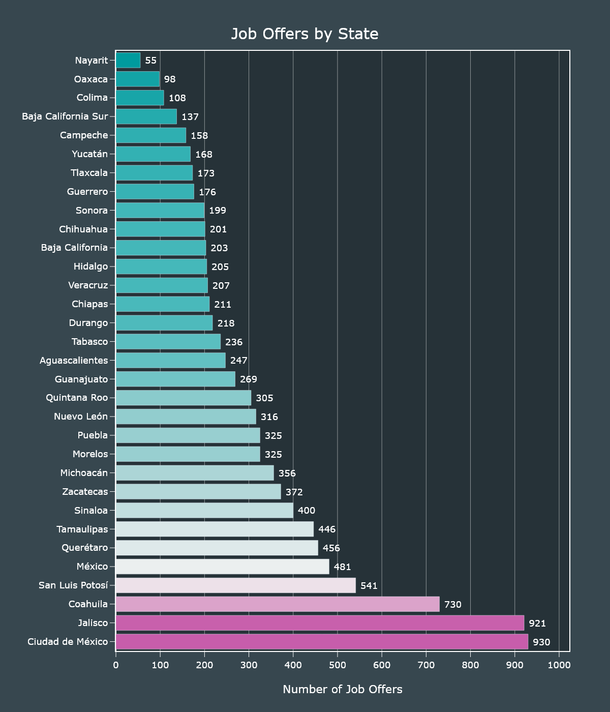

Plotting maps with `Plotly` requires a bit of tinkering. It is not as simple as with `GeoPandas` but once you get the hang of it, it becomes easy.

Since we are not working with US data we will provide our own set of coordinates. We will load the mexican GeoJSON file (included in this repository).

```python
geojson = json.loads(open("mexico.json", "r", encoding="utf-8").read())
```

In order to make our Choropleth map show our locations, we need to define 4 important parameters; `geojson`, `z`, `locations` and `featureidkey`.

* `geojson` is the full contents of our GeoJSON file.
* `locations` is a list of strings that must match the `featuredkey` parameter. I modified the GeoJSON file so it is compatible with our dataset out of the box. We don't need to worry about normalizing the names.
* `z` are the values to plot, which are the values from our states_series.
* `featuredkey` is the key inside the GeoJSON file to match with `locations`.

```python
fig.add_traces(go.Choropleth(geojson=geojson,
                                locations=states_series.index,
                                z=states_series.values,
                                featureidkey="properties.ADMIN_NAME"))

fig.show()
```

For the maps I will skip showing all the customizations but you can always read them in the `step3.py` file.

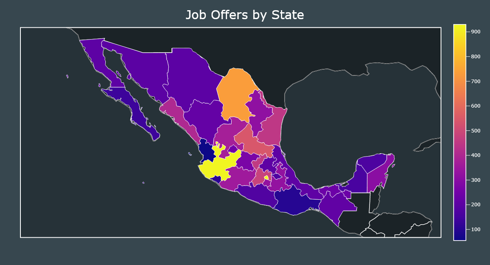

In this year we can observe that most states that depend on tourism had the lowest amount of job offers and those states that are located near the center and the Bajío had the most.

One explanation is that tourism and related activities were prohibited during COVID-19 confinement.


## Monthly Salaries

Let's start exploring the salaries by using the `describe()` method.

```python
df["salary"].describe()
```

|       | Salary in MXN |
|:------|---------:|
| count |   10,173 |
| mean  |    7,418 |
| std   |    4,266 |
| min   |    3,696 |
| 25%   |    5,000 |
| 50%   |    6,000 |
| 75%   |    8,000 |
| max   |   80,000 |

Most of the values increased compared with those from 2018, specially the minimum value, it went from 2,650 to 3,696.

The median stayed the same at 6,000 and the mean increased from 6,816 to 7,418.

Let's see the distribution using an Histogram. We will first remove the outliers and set up 35 bins.

```python
salaries = df[df["salary"] <= 35000]

fig = go.Figure()

fig.add_traces(go.Histogram(
    x=salaries["salary"], nbinsx=35, marker_color="#ffa000"))
```

We add final customizations.

```python

fig.update_xaxes(title="Monthly Salary", ticks="outside", ticklen=10, gridwidth=0.5,
                    tickcolor="#FFFFFF", linewidth=2, showline=True, mirror=True, nticks=35, title_standoff=20)

fig.update_yaxes(title="Number of Job Offers", ticks="outside", ticklen=10,
                    tickcolor="#FFFFFF", linewidth=2, gridwidth=0.5, showline=True, mirror=True, nticks=12, title_standoff=5)
```

We add final customizations.

```python
fig.update_layout(
    showlegend=False,
    width=1200,
    height=800,
    font_color="#FFFFFF",
    font_size=18,
    title_text="Salaries Distribution",
    title_x=0.5,
    title_y=0.93,
    margin_l=120,
    margin_b=120,
    title_font_size=30,
    paper_bgcolor="#37474f",
    plot_bgcolor="#263238"
)

fig.show()
```

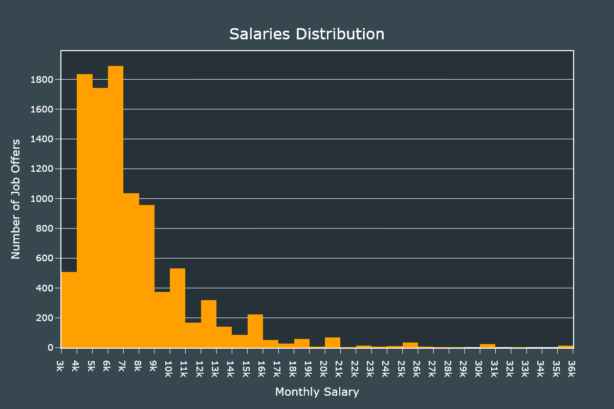

We can observe that the distribution is skewed to the right and most salaries are within the 4,000 - 7,000 range.

Now let's plot the median salary by state using an Horizontal Bar chart and a Choropleth map.

We will pivot our `DataFrame` so it shows the median salary by state.

```python
median_salaries = df.pivot_table(
    index="state", values="salary", aggfunc="median").sort_values("salary", ascending=False)
```

With our new `DataFrame` ready, we can now create our horizontal Bar chart. This new `DataFrame` only has one column (salary).

```python
fig = go.Figure()

fig.add_traces(go.Bar(x=median_salaries["salary"], y=median_salaries.index, text=median_salaries["salary"],
                        orientation="h", marker={"color": median_salaries["salary"], "colorscale": "peach"}))

fig.update_xaxes(title="Monthly Median Salary in MXN", ticks="outside", ticklen=10, tickcolor="#FFFFFF", separatethousands=True,
                    linewidth=2, showline=True, mirror=True, nticks=12, title_standoff=30, gridwidth=0.5, range=[0, median_salaries["salary"].max() * 1.1])

fig.update_yaxes(title="", ticks="outside", ticklen=10, showgrid=False,
                    tickcolor="#FFFFFF", linewidth=2, showline=True, mirror=True)

fig.update_traces(texttemplate=" %{text:,.0f}", textposition="outside")
```

We add final customizations.

```python
fig.update_layout(
    uniformtext_minsize=8,
    uniformtext_mode="hide",
    showlegend=False,
    width=1200,
    height=1400,
    font_color="#FFFFFF",
    font_size=18,
    title_text="Median Salary by State",
    title_x=0.5,
    title_y=0.96,
    margin_l=120,
    margin_b=120,
    title_font_size=30,
    paper_bgcolor="#37474f",
    plot_bgcolor="#263238"
)

fig.show()
```

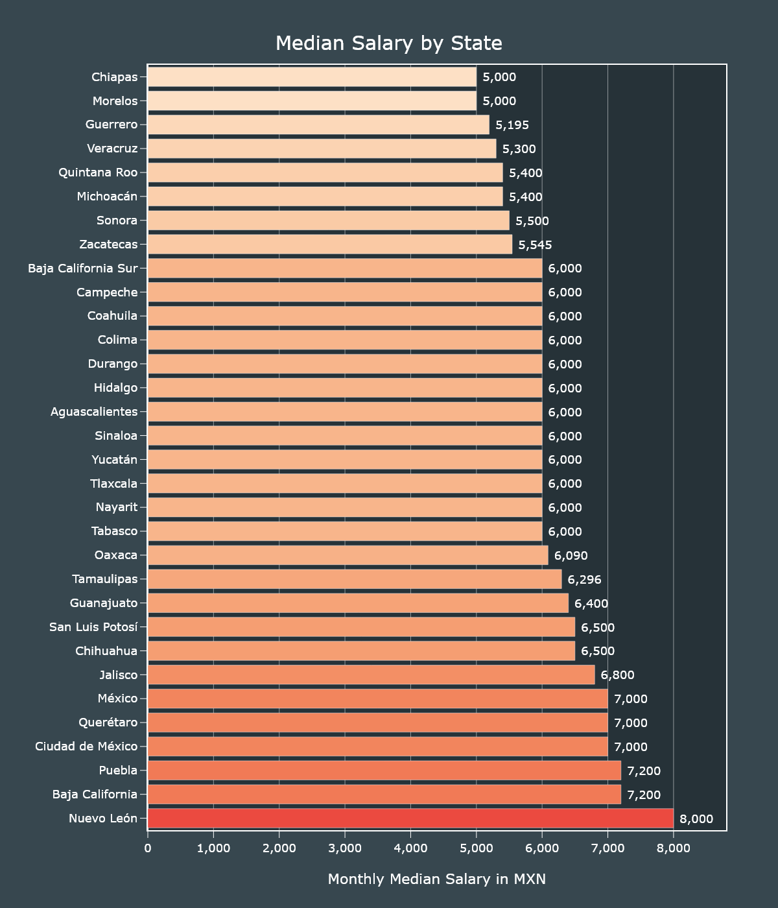

Now we will create a Choropleth map using the same pivoted `DataFrame`.

```python
geojson = json.loads(open("mexico.json", "r", encoding="utf-8").read())

fig = go.Figure()

fig.add_traces(go.Choropleth(geojson=geojson,
                             locations=median_salaries.index,
                             z=median_salaries["salary"],
                             featureidkey="properties.ADMIN_NAME"))

fig.show()
```

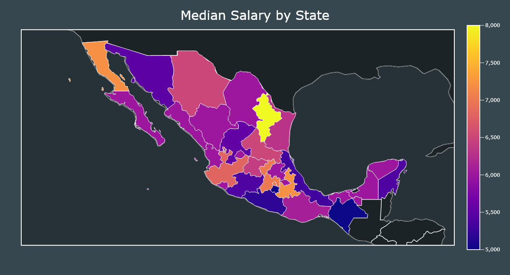

The state of Nuevo León has the highest median salary. This state is regarded as having one of the higher costs of living in the country.

On the other hand Chiapas has the lowest median salary and it is regarded as the poorest state in the country.

Baja California, Puebla, Jalisco, State of México and Mexico City also have higher costs of living that may explain the higher salaries.

## Labour Hours and Days

We will create 2 Histograms to identify the distribution of the required hours and number of days to work.

The customizations for both charts are identical, I will skip the second one to save space.

```python
fig = go.Figure()

fig.add_traces(go.Histogram(x=df["hours_worked"],  marker_color="#ffa000"))

fig.update_xaxes(title="Hours Required", ticks="outside", ticklen=10,  gridwidth=0.5,
                    tickcolor="#FFFFFF", linewidth=2, showline=True, mirror=True, nticks=35, title_standoff=20)

fig.update_yaxes(title="Number of Job Offers", ticks="outside", ticklen=10, separatethousands=True,
                    tickcolor="#FFFFFF", linewidth=2, showline=True, mirror=True, nticks=18, gridwidth=0.5, title_standoff=5)
```

We add final customizations.

```python
fig.update_layout(
    showlegend=False,
    width=1200,
    height=800,
    font_color="#FFFFFF",
    font_size=18,
    title_text="Labour Hours Distribution",
    title_x=0.5,
    title_y=0.93,
    margin_l=120,
    margin_b=120,
    title_font_size=30,
    paper_bgcolor="#37474f",
    plot_bgcolor="#263238"
)

fig.show()
```

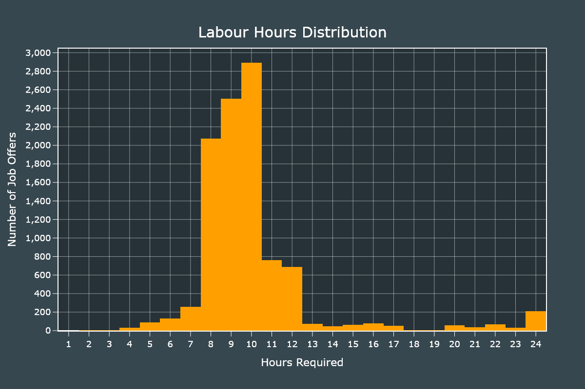

Most jobs required to work 8 hours or more. Some even required 24 hours.

Those jobs that require 24 hours shifts are usually security guards, drivers and convenience store staff.

Plotting the days distribution only requires to change the field.

```python
fig = go.Figure()

fig.add_traces(go.Histogram(x=df["days_worked"],  marker_color="#ffa000"))

fig.show()
```

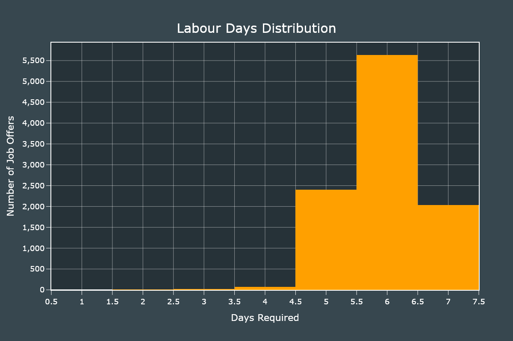

Most jobs require to work 6 days a week but we can also notice that jobs that require 4 or less days are almost inexistent.

## Education Level and Years of Experience

For these two fields we will use Donut charts, which are actually Pie charts with a hole.

The customization code for both charts is the same, I will show it only for the first one to save space.

We will start by defining a list of hex values that will be used to colorize our plots.

```python
colors = ["#0091ea", "#ff5722", "#43a047", "#7e57c2", "#1565c0",
            "#2e7d32", "#c62828", "#ef6c00", "#ffc400", "#64dd17"]
```

We create a series from the `education_level` field.

```python
education_level = df["education_level"].value_counts()

fig = go.Figure()

fig.add_traces(go.Pie(labels=education_level.index,
                      values=education_level.values,
                      marker_colors=colors,
                      hole=0.5,
                      insidetextfont_color="#FFFFFF"))
```

We add final customizations.

```python
fig.update_layout(
    legend_bordercolor="#FFFFFF",
    legend_borderwidth=1.5,
    legend_x=0.88,
    legend_y=0.5,
    font_color="#FFFFFF",
    font_size=18,
    title_text="Education Level Distribution",
    title_x=0.5,
    title_y=0.93,
    margin={"r": 0, "t": 150, "l": 0, "b": 50},
    width=1200,
    height=800,
    title_font_size=30,
    paper_bgcolor="#37474f"
)

fig.show()
```

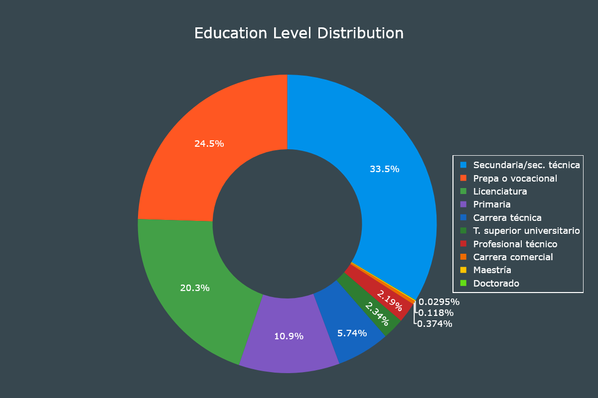

It is interesting to notice that 10% of job offers only require primary education and 58% of job offers require secondary education. Job offers that require a master's degree or doctorate are almost inexistent.

For the years of experience chart we will only require to create a series from the `experience` field.

```python
experience = df["experience"].value_counts()

fig = go.Figure()

fig.add_traces(go.Pie(labels=experience.index,
                      values=experience.values,
                      marker_colors=colors,
                      hole=0.5,
                      insidetextfont_color="#FFFFFF"))

fig.show()
```

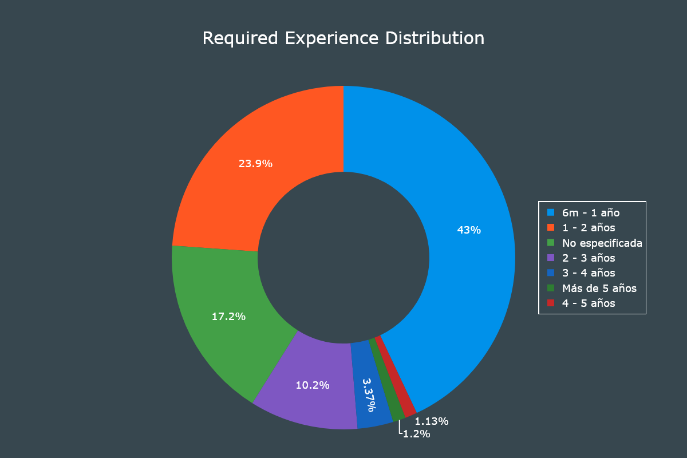

Most jobs don't require too much years of experience. This is an advantage for graduates and those that would be their first formal job.

# Correlations

To wrap things up let's check if having a higher education level and working more hours equates to having a higher salary.

For this task we will use Scatter plots.

The first thing to do is to remove the outliers.

From our dataset only 24 job listings had a salary greater than 35,000 MXN. We will remove those ones.

```python
df = df[df["salary"] <= 35000]
```

With the outliers removed we only require to create a Scatter plot and specify our x and y axis fields.

```python
fig = go.Figure()

fig.add_traces(go.Scatter(x=df["hours_worked"], y=df["salary"], line_color="#ffa000",
                            mode="markers", line_width=3, marker_size=8))

fig.update_xaxes(title="Number of Daily Hours", ticks="outside", ticklen=10,
                    tickcolor="#FFFFFF", title_standoff=30, linewidth=2, showline=True, mirror=True, nticks=25, gridwidth=0.5)

fig.update_yaxes(title="Monthly Salary in MXN", ticks="outside", ticklen=10, separatethousands=True,
                    tickcolor="#FFFFFF", title_standoff=20, linewidth=2, showline=True, mirror=True, nticks=12, gridwidth=0.5)

```

We add final customizations.

```python
fig.update_layout(
    showlegend=False,
    width=1200,
    height=800,
    font_color="#FFFFFF",
    font_size=18,
    title_text="Comparison of Hours Worked and Monthly Salary",
    title_x=0.5,
    title_y=0.93,
    margin_l=140,
    margin_b=120,
    title_font_size=30,
    paper_bgcolor="#37474f",
    plot_bgcolor="#263238"
)

fig.show()
```

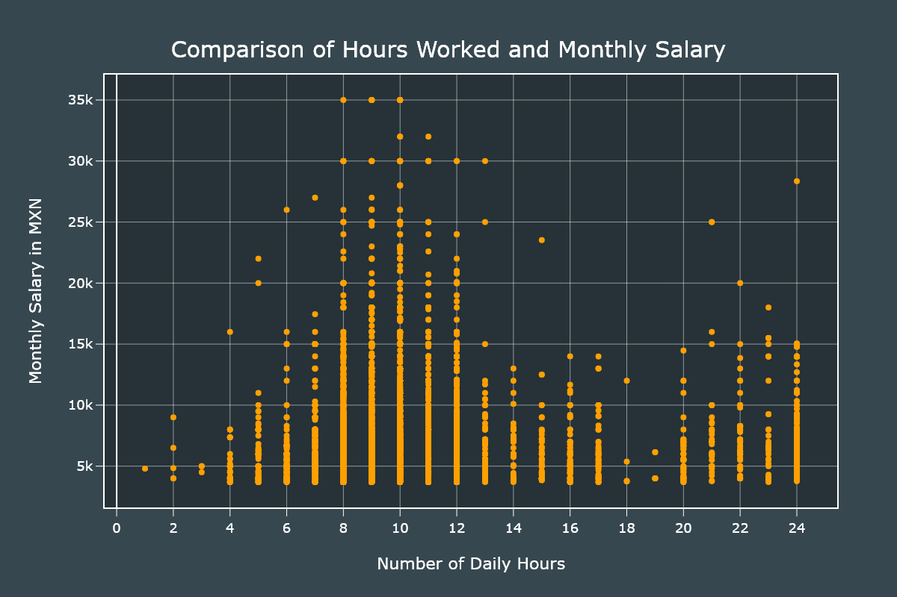

The jobs that require 8-10 hours are the ones that have the higher salaries. The 22-24 hours shifts also have high salaries but not as high as the previous group.

For the next plot we will need to convert categorical data to numerical one. We will use a map approach in which the higher the number is the higher the education level.

```python
education_map = {
    "Primaria": 1,
    "Secundaria/sec. técnica": 2,
    "Prepa o vocacional": 3,
    "Carrera técnica": 4,
    "Carrera comercial": 4,
    "Profesional técnico": 4,
    "T. superior universitario": 4,
    "Licenciatura": 5,
    "Maestría": 6,
    "Doctorado": 7
}

# We convert the categorical data to numerical.
df["education_level"] = df["education_level"].apply(
    lambda x: education_map[x])
```

With our field values updated we create a Scatter plot very similar to the previous one.

```python
fig = go.Figure()

fig.add_traces(go.Scatter(x=df["education_level"], y=df["salary"], line_color="#ffa000",
                            mode="markers", line_width=3, marker_size=8))

fig.show()
```

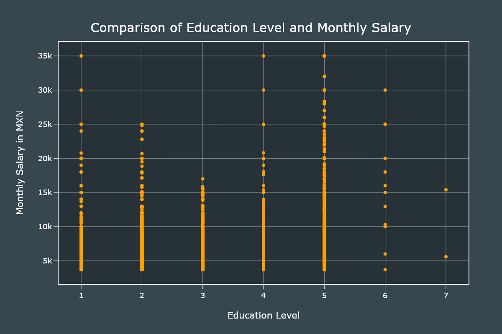

Those with a bachelor's degree are the ones that have higher salaries. It is interesting to note that rank 2 has higher saleries than rank 3.

# Conclusion

I really liked `Plotly`, it has a ton of customizations and once you get the hang of it, you can become productive very fast. I will be using it for my next projects, that's for sure.

For the job offers, the situation is very grim. When I did this project in 2018 I collected around 36,000 job offers. This time I only collected 10,000 and that was with the help of secondary scripts to fix all the issues.

There are some fields I didn't covered in this article but you are always free to study the dataset.

[](https://www.patreon.com/bePatron?u=20521425)